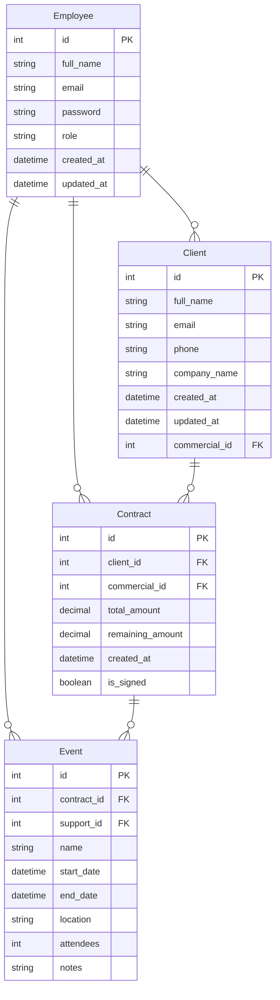

# Database Diagram

```mermaid
erDiagram
    Employee {
        int id PK
        string full_name
        string email
        string password
        string role
        datetime created_at
        datetime updated_at
    }

    Client {
        int id PK
        string full_name
        string email
        string phone
        string company_name
        datetime created_at
        datetime updated_at
        int commercial_id FK
    }

    Contract {
        int id PK
        int client_id FK
        int commercial_id FK
        decimal total_amount
        decimal remaining_amount
        datetime created_at
        boolean is_signed
    }

    Event {
        int id PK
        int contract_id FK
        int support_id FK
        string name
        datetime start_date
        datetime end_date
        string location
        int attendees
        string notes
    }

    Employee ||--o{ Client : ""
    Employee ||--o{ Contract : ""
    Employee ||--o{ Event : ""
    Client ||--o{ Contract : ""
    Contract ||--o{ Event : ""

    %% Role constraints
    %% Commercial employees can manage clients and contracts
    %% Support employees can manage events
    %% Management employees can manage all
``` 